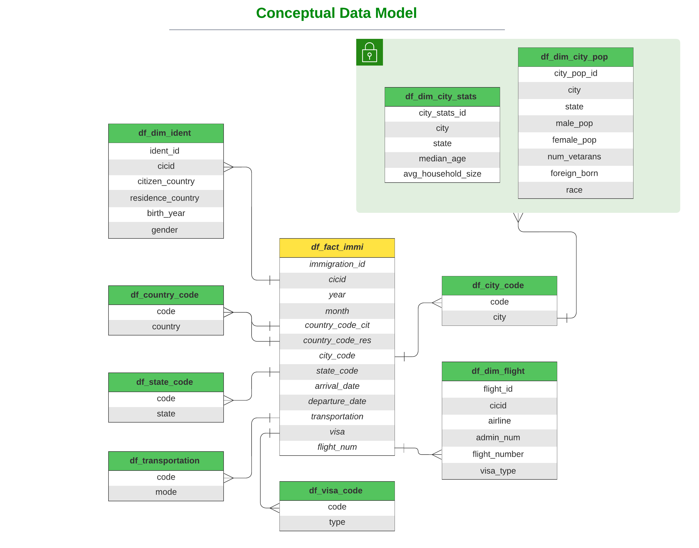

## Data Engineering Capstone Project

#### Project Summary
An ETL pipeline for I94 immigration, global land temperatures and US demographics datasets is created to form an analytics database on immigration events. A use case for model is to find patterns of immigration to the United States.

 
The project follows the follow steps:

* Step 1: Scope the Project and Gather Data
* Step 2: Explore and Assess the Data
* Step 3: Define the Data Model
* Step 4: Run ETL to Model the Data
* Step 5: Complete Project Write Up

___

### Step 1: Scope the Project and Gather Data

### Scope 
- I94 immigration data and US demographic datasets were implemented to setup a data pipeline with fact and dimension tables wherein they are used for analytics.

 

### Describe and Gather Data 

#### The following datasets are available to create the analytics database:
* I94 Immigration Data: This data comes from the US National Tourism and Trade Office. A data dictionary is included in the workspace. [This](https://travel.trade.gov/research/reports/i94/historical/2016.html) is where the data comes from. There's a sample file so you can take a look at the data in csv format before reading it all in. You do not have to use the entire dataset, just use what you need to accomplish the goal you set at the beginning of the project.
* World Temperature Data: This dataset came from Kaggle. You can read more about it [here](https://www.kaggle.com/berkeleyearth/climate-change-earth-surface-temperature-data).
> ### No temperature data available for US cities to match with immigration data in 2016.
* U.S. City Demographic Data: This data comes from OpenSoft. You can read more about it [here](https://public.opendatasoft.com/explore/dataset/us-cities-demographics/export/).
* Airport Code Table: This is a simple table of airport codes and corresponding cities. It comes from [here](https://datahub.io/core/airport-codes#data/).
 
___

### The Datasets used:
| Data Set | Format |
|---|---|
| I94 Immigration Data | SAS |
| U.S. City Demographic Data | CSV |

 

### The Tools used:
- Pandas: exploratory data analysis on small data set
- PySpark: data processing on large data set
- Python: data processing
- AWS S3: data storage

 

### Step 2: Explore and Assess the Data
 

#### Explore the Data
- Pandas and PySpark are used to explore with data analysis to get insights on these data sets.
- Datasets are split and paired into dimensional tables and renamed for better understood columns.
- Utilize PySpark on one of the SAS data sets to test ETL data pipeline logic.

#### Cleaning Steps
- Transform `arrdate`, `depdate` from SAS time format into PySpark DateType.
- Parse `Labels_Description` file to get auxiliary dimension tables `country_code`, `city _code`, `state _code`, `visa_code`, `transportation`.
- Tranform `city`, `state` to upper case to match `city_code` and `state_code` table

### Step 3: Define the Data Model
#### 3.1 Conceptual Data Model
This project implements the schema shown below as a data model to use it for the purpose of analytics and BI dashboards.
#### 3.2 Mapping Out Data Pipelines

### Step 4: Run Pipelines to Model the Data 
#### 4.1 Create the data model
Data Pipeline Steps:

- Assume our datasets reside in an S3 bucket
- **[Source_S3_Bucket]**/18-83510-I94-Data-2016/*.sas7bdat
- **[Source_S3_Bucket]**/I94_SAS_Labels_Descriptions.SAS
- **[Source_S3_Bucket]**/us-cities-demographics.csv
- Perform some data perparations and clean-ups on our datasets.
- Transform I94_Immigration dataset into a fact table - partitioned by `state` - and 2 dimension tables.
- Parsing label description file to get auxiliary descriptive tables
- Transform US City Demographics dataset into 2 dimension tables
- Populate analytics tables and store in destination S3 bucket

#### 4.2 Data Quality Checks

#### Data quality checks includes

1. Data schema of every dimensional table matches data model.
2. No empty table after running ETL data pipeline.

#### 4.3 Data dictionary 
#### The full source data dictionary:
Refer to [data_dictionary.md](https://github.com/khaledshabasy/Data-Modeling-Spark-udacity-capstone/blob/master/data_dictionary.md)
 

#### The data model dictionary:
Refer to [model_data_dictionary.md](https://github.com/khaledshabasy/Data-Modeling-Spark-udacity-capstone/blob/master/model_data_dictionary.md)

#### Step 5: Complete Project Write Up

#### Tools and Technologies:
+ AWS S3 for data storage
+ Pandas for sample data set exploratory data analysis
+ PySpark for large data set data processing to transform staging table to dimensional table

#### how often the data should be updated and why:
- ***Pipeline will be scheduled monthly as immigration data is the primary datasource is on a monthly schedule***

#### Write a description of how you would approach the problem differently under the following scenarios:

#### - The data was increased by 100x:

- Spark can handle the increase. if the standanlone mode cannot, [AWS EMR](https://aws.amazon.com/emr/) is preferabele to make use of multiple nodes adding to the computing power through distributed systems.

 

#### - The data populates a dashboard that must be updated on a daily basis by 7am every day:
- [Apache Airflow](https://airflow.apache.org/) will be used to schedule and run data pipelines.

 

#### - The database needed to be accessed by 100+ people:
- We shall move our analytics database into [Amazon Redshift](https://aws.amazon.com/redshift/) as it can handle up to 500 concurrent connections per cluster. 